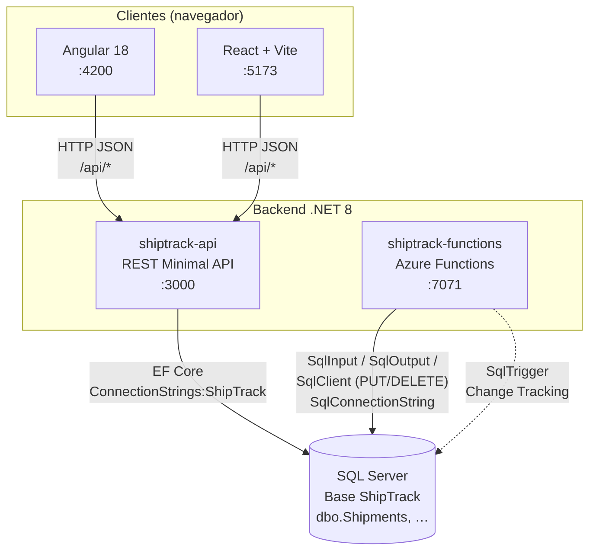
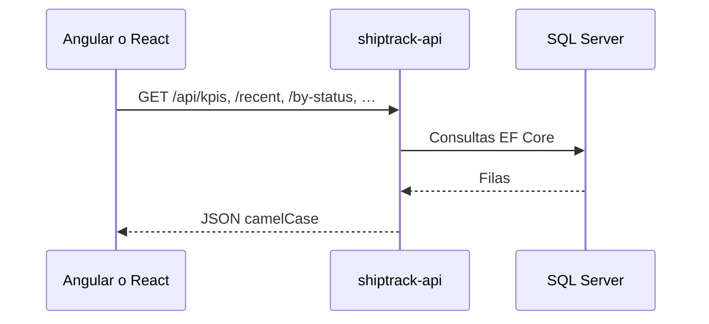
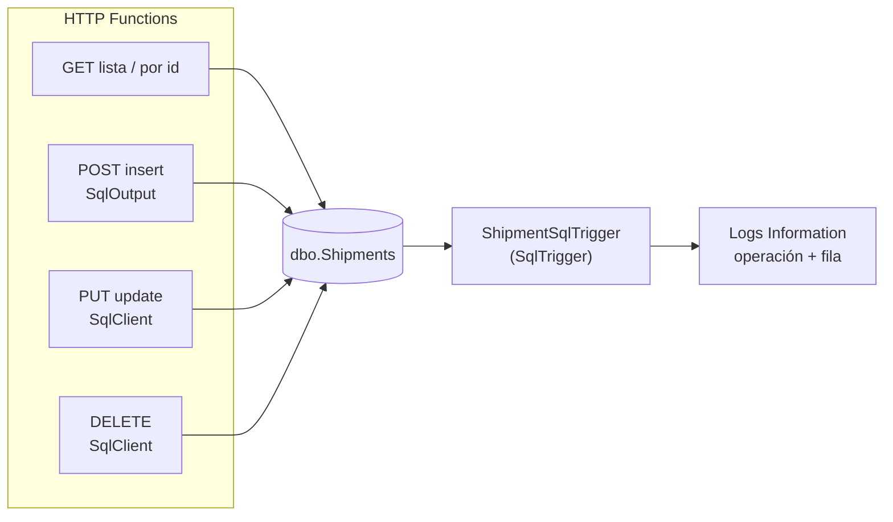
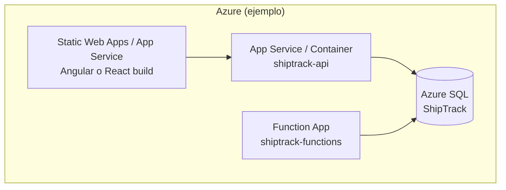

# Arquitectura — DemoLogistic / ShipTrack

Diagramas en [Mermaid](https://mermaid.js.org/). En GitHub/GitLab se muestran al previsualizar el archivo.

---

## Vista de componentes (desarrollo local)

Rutas HTTP de Functions: `/api/fn/shipments`, `/api/fn/shipments/{id}` (GET/POST/PUT/DELETE).

Los frontends **no** llaman a Functions en el flujo principal del demo: consumen la **API** en el puerto **3000**. Functions comparte la **misma base** y expone CRUD HTTP alternativo bajo **`/api/fn/...`**.

---

## Flujo de datos: dashboards y tablas (Angular / React → API)

---

## Flujo: Azure Functions y SQL

El **SqlTrigger** reacciona a cambios en **`dbo.Shipments`** (INSERT/UPDATE/DELETE en base) y los registra; el **POST** usa enlace **`SqlOutput`**; **PUT/DELETE** usan **`Microsoft.Data.SqlClient`** con la misma cadena **`SqlConnectionString`**.

---

## Despliegue lógico (referencia)

En local, los cuatro procesos sustituyen a esos servicios; la **única fuente de verdad** relacional es la base **ShipTrack**.

---

## Puertos por defecto

| Servicio | Puerto típico |
|----------|----------------|
| shiptrack-api | 3000 |
| Angular `ng serve` | 4200 |
| React `vite` | 5173 |
| Azure Functions Core Tools | 7071 |

Si un puerto está ocupado, CLI puede elegir otro (`--port` en Angular, Vite incremental, etc.).
