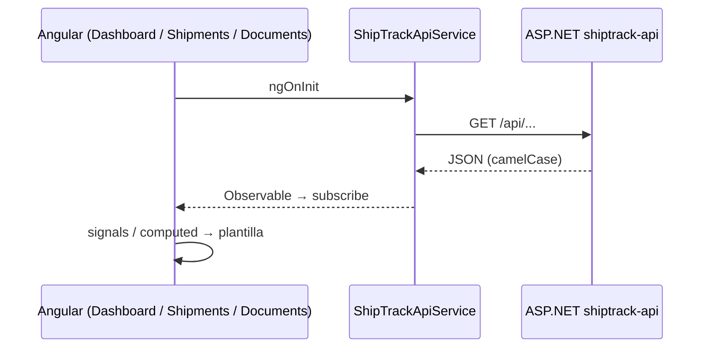

# Implementación ShipTrack: Angular + API .NET

Este documento describe cómo está armada la integración entre el front **Angular** y el backend **ASP.NET Core** del repositorio DemoLogistic / ShipTrack.

---

## Visión general

| Capa | Ubicación | Rol |
|------|-----------|-----|
| API REST | `shiptrack-api/` | Sirve datos dummy en JSON (misma forma que tenía el mock original). |
| Front | `angular/` | Consume la API con `HttpClient` en Dashboard, Shipments y Documents. |

La API corre por defecto en **http://localhost:3000** y Angular en **http://localhost:4200**. La API habilita **CORS** para esos orígenes (y el de Vite en 5173 por si usas el front React).

---

## Backend (`shiptrack-api`)

### Tecnología

- **ASP.NET Core 8**, Minimal API (sin controladores clásicos).
- **Swashbuckle** para **Swagger UI** en entorno Development (`/swagger`).
- Serialización JSON en **camelCase** para alinearla con el front.

### Datos

Los datos siguen en memoria, definidos en `DummyData.cs`, equivalentes al antiguo `mock.service.ts` / `mock.js`.

### Endpoints relevantes para Angular

| Método | Ruta | Uso en el front |
|--------|------|-----------------|
| `GET` | `/api/kpis` | Tarjetas KPI del dashboard |
| `GET` | `/api/shipments/recent` | Lista “Recent Shipments” |
| `GET` | `/api/shipments/by-status` | Gráfico de barras por estado |
| `GET` | `/api/shipments` | Tabla completa de envíos (opcionalmente `?q=` y `?status=`) |
| `GET` | `/api/documents` | Lista de documentos (opcionalmente `?type=`) |

Detalle de contratos: `shiptrack-api/API.md`.

### Ejecución

```bash
cd shiptrack-api
dotnet run
```

---

## Front (`angular`)

### Configuración global

- **`app.config.ts`**: se registra `provideHttpClient()` para poder inyectar `HttpClient` en servicios.
- **`src/environments/environment.ts`**: `apiUrl` (por defecto `http://localhost:3000`).
- **`angular.json`**: en la configuración **development** de build, `fileReplacements` sustituye `environment.ts` por `environment.development.ts` (misma `apiUrl` hoy; sirve para separar entornos más adelante).

### Modelos (`src/app/data/shiptrack.models.ts`)

Interfaces TypeScript que reflejan el JSON de la API: `KpiCard`, `RecentShipment`, `ShipmentByStatus`, `ShipmentRow`, `DocumentItem`. Así el tipado del front coincide con lo que devuelve .NET.

### Servicio HTTP (`src/app/data/shiptrack-api.service.ts`)

- `providedIn: 'root'`.
- Inyecta `HttpClient` y usa `environment.apiUrl` como prefijo.
- Un método por recurso (`getKpis()`, `getShipments()`, etc.), usando `HttpParams` cuando hay query strings.

### Páginas conectadas

1. **Dashboard** (`pages/dashboard/`)
   - En `ngOnInit`, `forkJoin` de `getKpis()`, `getRecentShipments()` y `getShipmentByStatus()`.
   - Resultados en **signals**; la plantilla usa `kpiCards()`, `recentShipments()`, `shipmentByStatus()`.
   - `maxCount` es un `computed` a partir de los conteos por estado.
   - Estados **loading** y **error** (mensaje si la API no responde).

2. **Shipments** (`pages/shipments/`)
   - `getShipments()` al iniciar → signal `rows`.
   - El buscador sigue filtrando en **cliente** sobre `rows` (misma UX que antes con mock).

3. **Documents** (`pages/documents/`)
   - `getDocuments()` al iniciar → signal `documents`.
   - Las pestañas filtran en **cliente** por `type` (`all`, `bill`, `invoice`, `certificate`).

### Mock local (`src/app/data/mock.service.ts`)

Sigue existiendo con los mismos datos en memoria por si quieres una demo sin API; las pantallas anteriores ya no lo usan por defecto.

### Ejecución

Con la API en marcha:

```bash
cd angular
npm install   # la primera vez
npm start
```

Abre **http://localhost:4200**.

---

## Flujo de datos (resumido)



---

## Qué no está en la API (aún)

- **Settings**, **Tracking** y **Analytics** en Angular siguen siendo locales o placeholder; no hay endpoints dedicados.
- No hay autenticación ni persistencia en base de datos: todo es **dummy en memoria** en el servidor.

---

## Referencias rápidas

- Contrato HTTP: `shiptrack-api/API.md`
- Swagger (con la API en Development): `http://localhost:3000/swagger`
- Notas de arranque del front: `angular/README.md`
