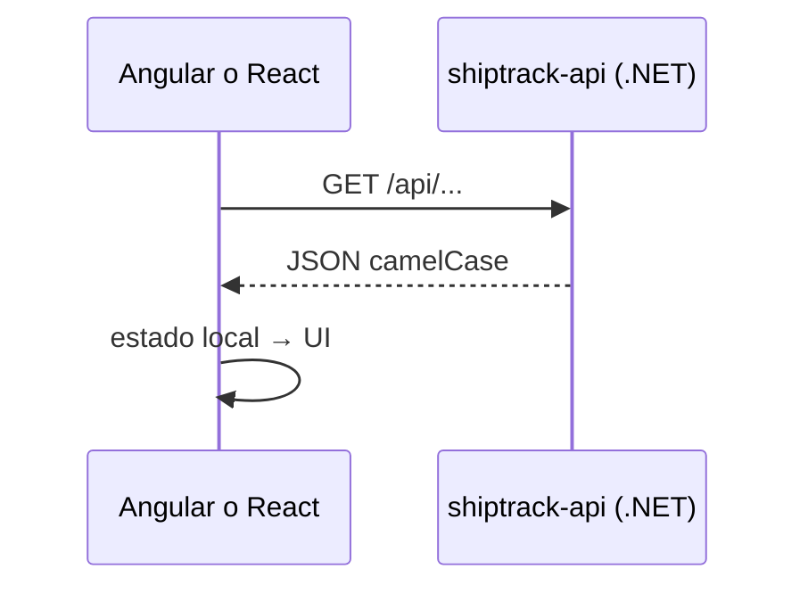

# Implementación ShipTrack: Angular, React + API .NET

Este documento describe la integración entre los fronts **Angular** y **React** con el backend **ASP.NET Core** (DemoLogistic / ShipTrack).

---

## Visión general

| Capa | Ubicación | Rol |
|------|-----------|-----|
| API REST | `shiptrack-api/` | Lee datos desde **SQL Server** (base `ShipTrack`; script en `Scripts/CreateShipTrack.sql`). |
| Front Angular | `angular/` | `HttpClient` + servicio inyectable. |
| Front React | `react/` | `fetch` + módulo `shiptrackApi.js`. |

La API corre por defecto en **http://localhost:3000**. CORS permite **4200** (Angular) y **5173** (Vite).

---

## Backend (`shiptrack-api`)

- **ASP.NET Core 8**, Minimal API, **Swagger** en Development (`/swagger`).
- **EF Core** + proveedor SQL Server. JSON en **camelCase**.
- Cadena de conexión: `ConnectionStrings:ShipTrack` (LocalDB por defecto).

### Endpoints usados por ambos fronts

| Método | Ruta | Uso |
|--------|------|-----|
| `GET` | `/api/kpis` | KPIs del dashboard |
| `GET` | `/api/shipments/recent` | Envíos recientes |
| `GET` | `/api/shipments/by-status` | Barras por estado |
| `GET` | `/api/shipments` | Tabla de envíos (`?q=`, `?status=`) |
| `GET` | `/api/documents` | Documentos (`?type=`) |

Contrato detallado: `shiptrack-api/API.md`.

```bash
cd shiptrack-api
dotnet run
```

---

## Front Angular (`angular/`)

- **`provideHttpClient()`** en `app.config.ts`.
- **`src/environments/environment.ts`**: `apiUrl` (default `http://localhost:3000`); `fileReplacements` en build **development**.
- **`shiptrack.models.ts`**: interfaces.
- **`shiptrack-api.service.ts`**: métodos HTTP tipados.
- **Dashboard**: `forkJoin` en `ngOnInit` + signals + loading/error.
- **Shipments** / **Documents**: carga inicial desde API; búsqueda y pestañas en cliente.
- **`mock.service.ts`**: opcional, sin uso por defecto en esas páginas.

```bash
cd angular
npm start
```

→ **http://localhost:4200**

---

## Front React (`react/`)

- **`src/config.js`**: `apiUrl` desde `import.meta.env.VITE_API_URL` con fallback `http://localhost:3000`.
- **`.env.development`**: `VITE_API_URL=http://localhost:3000` (Vite solo expone variables con prefijo `VITE_`).
- **`src/api/shiptrackApi.js`**: `fetch` + helpers `getKpis`, `getShipments`, etc.
- **Dashboard**: `useEffect` + `Promise.all` de tres endpoints; `useMemo` para `maxCount`; estados loading/error.
- **Shipments** / **Documents**: mismo patrón que Angular (carga API + filtro local).
- **`src/data/mock.js`**: referencia offline, sin uso en esas páginas.

```bash
cd react
npm run dev
```

→ **http://localhost:5173**

---

## Flujo de datos (resumido)



---

## Qué no está en la API (aún)

- **Settings**, **Tracking** y **Analytics** siguen locales o placeholder.
- Sin autenticación ni base de datos: todo **dummy en memoria** en el servidor.

---

## Referencias

- `shiptrack-api/API.md` — endpoints
- `http://localhost:3000/swagger` — OpenAPI (Development)
- `angular/README.md` — arranque Angular
- `react/README.md` — arranque React
